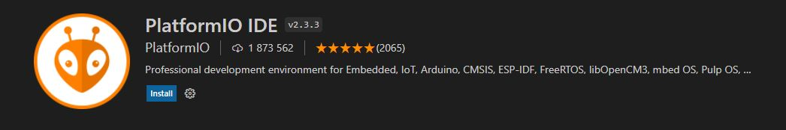
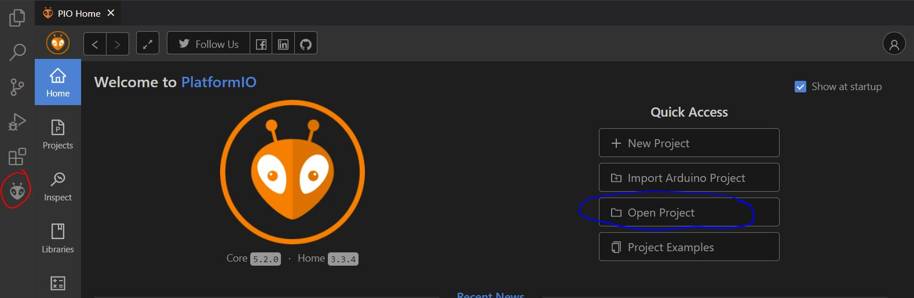
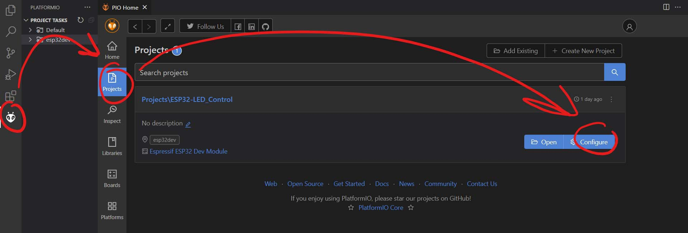
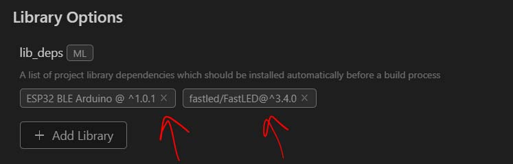

# Overview
My code for ESP32 (espressif32) board. Which is used for controlling Classic LED strip and Addressable LED strip via mobile app over low energy bluetooth protocol (BLE).

## What does projects contains?
### Libraries for microcontroller code:
For addressable LED strip and multiple color effects: [FastLED](https://github.com/FastLED/FastLED), [Documentation 1](http://fastled.io/docs/3.1/index.html), [Documentation 2](https://github.com/FastLED/FastLED/wiki/Overview)  
For Bluetooth communication: [BLE](https://www.arduino.cc/reference/en/libraries/esp32-ble-arduino/), [Documentation](https://github.com/nkolban/ESP32_BLE_Arduino)  
### Hardware for circuit build:
Check out: [Schematic](/docs/schematics/Schematic.pdf)
- 12V power supply (max power depands how many LEDs strips you would like to drive. For me 50W (4A)).
- [Mini SMD step-down 12V](/docs/media/stepdown.png) => 5V for microcontroller.
- IoT ESP-WROOM-32 2.4GHz Dual-Mode CP2102 with 4MB Flash.
- [level shifter](/docs/media/levelshifter.png) (required only if Addressable LED stip is not getting strong enought data signal, depends on your Microcontroller)
- LEDs strips
### Software for controlling:
- Software used for developement [MIT App Inventor](http://ai2.appinventor.mit.edu)
- Mobile app released + [Source](/mobile_app/LED_Controller_AndroidApplication.aia).

## Get started
1. Install [Visual Studio Code](https://code.visualstudio.com/)
2. Install [PlatformIO IDE](https://platformio.org/) extension (Depending on your Python version you can get error like [this](https://community.platformio.org/t/platformio-installation-failed/17419))

3. Clone repository
4. Open PlatformIO inside Visual Studio Code and click on **Open Project** and import cloned repository. 1. select PlatformIO (RED icon) 2. Import project (BLUE icon)

5. Check if you have all required libraries

  
6. Got to [Definitions](include/definitions.h) And add(generate) your own CHARACTERISTIC_UUIDs.

## Files explanation
no_ota.csv => file that sets correct partition sizes, needed because BLE library is quite huge. [More info](https://iotespresso.com/how-to-set-partitions-in-esp32/).  
platformio.ini => file that applies **partition config** and sets correct **dev. board**, **lib dependencies** and other settings. (It's something like simple MAKEFILE)
## License
Not yet...
